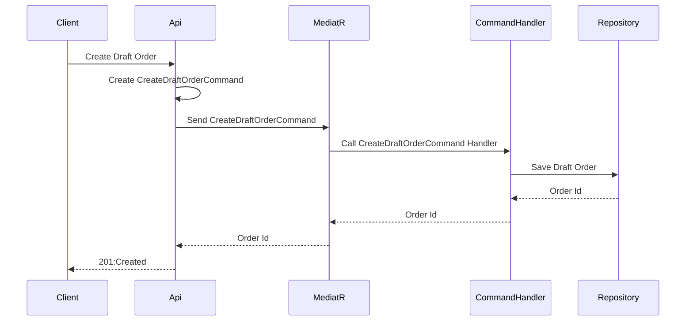
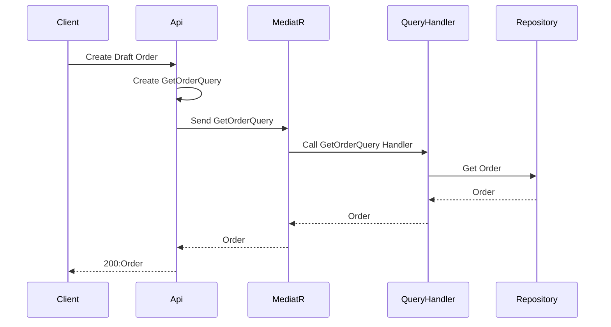

# Checkout Service
This service is built using the following approaches:
* Onion Architecture
* Doman Driven Design - Tactical design to create the Domain Model
* CQRS implemented using MediatR

## Domain
The domain layer Contains a domain model which is designed using DDD tactical design patterns (entities, value objects, aggregates, domain events...).
This layer is independent and does not have reference to any other layer.

 

## Application
The application layer contains an implementation of commands,  queries, and as well as corresponding handlers for commands and queries. Also, it contains abstraction (interfaces) for repositories.
This layer has a reference only to the Domain.

## Infrastructure
The infrastructure layer contains an implementation of Repositories.
This layer can have references to the Domain and the Application layers.

## EF Core 
EF Core is used as a object relation mapper.
EFCore command-line commands for migrations.
* add-migration create_database
* update-database

## Sequence diagram

### Create Draft Order - Command 

### Get Order - Query

